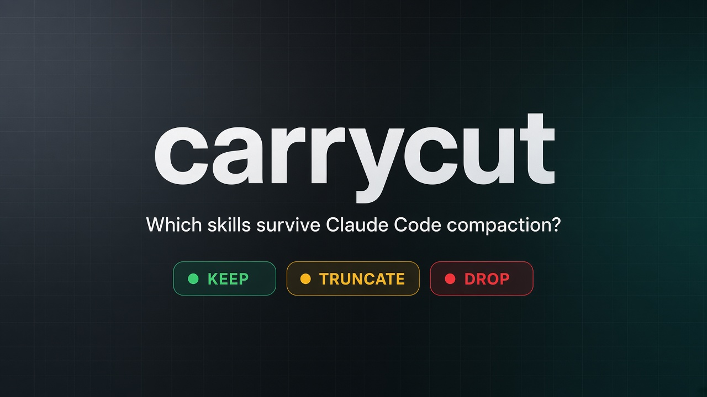
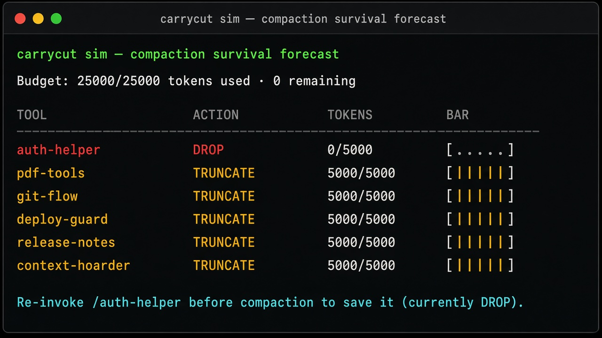
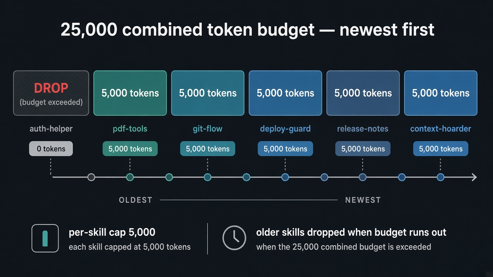

# carrycut

[](https://www.npmjs.com/package/carrycut)
[](LICENSE)
[](https://nodejs.org)
[](https://github.com/YOUR_GITHUB_USER/carrycut/actions/workflows/ci.yml)

**Simulate which skills survive Claude Code compaction** — and watch your live session so critical skills don’t vanish silently.



`carrycut` is an offline **session guardian** CLI. It predicts whether invoked [Claude Code skills](https://code.claude.com/docs/en/skills) will be **kept**, **truncated**, or **dropped** when auto-compaction re-attaches them.

It is a **simulation / diagnostic** tool. It does not change Claude Code’s behavior.

## Why it exists

- After `/compact` (or auto-compaction), older skills can **disappear entirely** — not just shrink.
- Claude Code re-attaches skills **newest-first** inside a **25,000-token** shared budget (max **5,000** per skill).
- `carrycut watch` warns **before** a critical skill would be lost, so you can re-invoke it in time.

## Quick start

Requires Node.js ≥ 18. No network calls at runtime.

**Install from [npm](https://www.npmjs.com/package/carrycut):**

```bash
npm install -g carrycut

# Scan the active Claude Code session
carrycut sim --session auto
carrycut watch --once --session auto

# Or without a global install
npx carrycut@2 sim --session auto
```

**Simulate a known invocation order** (uses skills from `.claude/skills/` or `~/.claude/skills/`):

```bash
carrycut sim --invoked auth-helper,pdf-tools,git-flow,deploy-guard
carrycut sim --invoked auth-helper,deploy-guard --critical auth-helper --json
```

**Try the DROP demo from this repo** (demo fixtures are git-only, not in the npm tarball):

```bash
git clone https://github.com/YOUR_GITHUB_USER/carrycut.git
cd carrycut
npm install && npm run build
node dist/cli.js sim \
  --invoked auth-helper,pdf-tools,git-flow,deploy-guard,release-notes,context-hoarder \
  --skills-root demo/skills \
  --critical auth-helper
```

## Example output



```
carrycut sim — compaction survival forecast
Budget: 25000/25000 tokens used · 0 remaining

SKILL                   STATUS    TOKENS          BAR
------------------------------------------------------------
auth-helper             DROP      0/5221          [░░░░░░░░░░] 0/5000
pdf-tools               TRUNCATE  5000/5125       [██████████] 5000/5000
...
Suggestions:
  → Re-invoke /auth-helper before compaction to save it (currently DROP).
```

`auth-helper` was invoked first. Five newer skills fill the 25k budget; it is **dropped**, not truncated. (Five skills at the 5k cap fit exactly; a sixth large skill triggers the silent DROP.)

## How Claude Code compaction re-attaches skills

Verified against the official docs on **2026-09-10**:
[code.claude.com/docs/en/skills](https://code.claude.com/docs/en/skills)



1. Each re-attached skill keeps at most its **first 5,000 tokens**.
2. All re-attached skills share a **combined budget of 25,000 tokens**.
3. That budget is filled **newest → oldest**. When it runs out, older skills are **removed entirely**.
4. Identical re-invocations are deduplicated; changed args / dynamic context append full content again.

## Commands

### `carrycut sim`

```bash
carrycut sim --invoked skillA,skillB,skillC
carrycut sim --session auto
carrycut sim --invoked auth-helper --critical auth-helper --json
```

| Flag | Meaning |
|------|---------|
| `--invoked a,b,c` | Order; **last = most recent** |
| `--session auto\|path` | Parse Claude Code JSONL under `~/.claude/projects/` |
| `--critical a,b` | Exit **1** if any would **DROP** |
| `--strict` | Also fail on **TRUNCATE** for `--critical` |
| `--calibration 1.15` | tiktoken→Claude estimate multiplier |
| `--skills-root dir` | Extra `<name>/SKILL.md` root |
| `--json` | Machine-readable output |

Skills with `!`cmd`` dynamic context show a `~DYNAMIC` badge (static-body estimate only).

### `carrycut watch`

```bash
carrycut watch --session auto
carrycut watch --once --critical auth-helper --json
```

| Flag | Meaning |
|------|---------|
| `--session auto\|path` | Transcript to watch (default `auto` if no `--invoked`) |
| `--critical a,b` | Alert only for these; without it, **any DROP** alerts |
| `--interval 5` | Poll seconds (default 5) |
| `--once` | Single check (CI / hooks) |
| `--json` | NDJSON `{ "type": "ok"\|"alert", ... }` |

Alerts are **edge-triggered** (state changes only).

### `carrycut stale`

```bash
carrycut stale --session auto
carrycut stale --invoked auth-helper --session auto --hash --json
```

Compares `SKILL.md` mtime (and optional hash) to the last invocation timestamp — the “stale re-attach” footgun.

## Token estimates

Uses **js-tiktoken** (`o200k_base`) × calibration (default **1.15**). Approximate, not Anthropic’s tokenizer. Near thresholds, re-invoke critical skills.

## Exit codes

| Code | Meaning |
|------|---------|
| `0` | OK |
| `1` | Critical DROP / watch alert / stale drift |
| `2` | Usage / input error |

## Complementary tools

carrycut only simulates **compaction survival**. For skill quality audits, use a skill-doctor first:

- [MindiveLabs/skill-doctor](https://github.com/MindiveLabs/skill-doctor)
- [JoaquinCampo/skill-doctor](https://github.com/JoaquinCampo/skill-doctor)
- [amaljithkuttamath/skill-doctor](https://github.com/amaljithkuttamath/skill-doctor)
- [SomeStay07/claude-doctor-skill](https://github.com/SomeStay07/claude-doctor-skill)

## Demo fixtures

Six oversized skills under [`demo/skills/`](demo/skills/) make the `auth-helper` DROP obvious. They ship with the **git repo only** (not the npm package). See [demo/README.md](demo/README.md).

## Contributing

See [CONTRIBUTING.md](CONTRIBUTING.md), [CHANGELOG.md](CHANGELOG.md), [CODE_OF_CONDUCT.md](CODE_OF_CONDUCT.md), and [SECURITY.md](SECURITY.md).

Published on npm as [`carrycut@2.0.0`](https://www.npmjs.com/package/carrycut). Replace `YOUR_GITHUB_USER` in badges / `package.json` with your GitHub username when the GitHub repo is public.

## License

[MIT](LICENSE)
